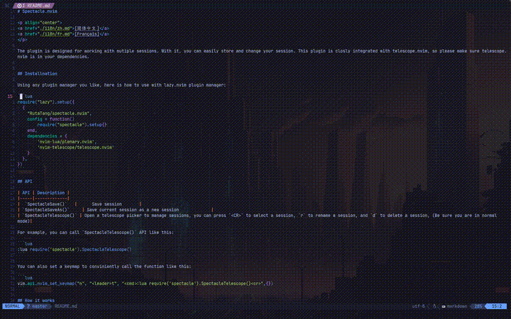

# Spectacle.nvim

<p align="center">
<a href="./i18n/zh.md">[简体中文]</a>
<a href="./i18n/fr.md">[Français]</a>
</p>

The plugin is designed for working with mutiple sessions. With it, you can easily store and change your session. This plugin is closly integrated with telescope.nvim, so please make sure telescope.nvim is in your dependencies.

<p align="center">
  
</p>

## Installnation

Using any plugin manager you like, here is how to use with lazy.nvim plugin manager:

```lua
require("lazy").setup({
  {
    "RutaTang/spectacle.nvim",
    dependencies = {
        'nvim-lua/plenary.nvim',
        'nvim-telescope/telescope.nvim'
    }
        opts = {session_dir = "/path/of/dir/where/you/want/to/save/all/sessions"}
  },
})
```

## Configuration

So far only Configuration is to provide the path of the directory where your want to save all your session via passing ```session_dir``` in ```opts```, otherwise leave it as blank table i.e. ```opts = {}```, and it will save all the session into directory **.spectacle** at the current working directory of the working file.

## API

| API                    | Description                                                                                                                                                                  |
| ---------------------- | ---------------------------------------------------------------------------------------------------------------------------------------------------------------------------- |
| `SpectacleSave()`      | Save session                                                                                                                                                                 |
| `SpectacleSaveAs()`    | Save current session as a new session                                                                                                                                        |
| `SpectacleTelescope()` | Open a telescope picker to manage sessions, you can press `<CR>` to select a session, `r` to rename a session, and `d` to delete a session, (Be sure you are in normal mode) |

For example, you can call `SpectacleTelescope()` API like this:

```lua
:lua require('spectacle').SpectacleTelescope()
```

You can also set a keymap to conviniently call the function like this:

```lua
vim.api.nvim_set_keymap("n", "<leader>t", "<cmd>:lua require('spectacle').SpectacleTelescope()<cr>",{})
```

## How it works

It simply saves the session content generated from command `:mksession` to a folder named `.spectacle` stored in current working directory. The session file stored in `.spectacle` folder stands for a single session. Its name is the session name. For example, conisder you create a session named `default`, its session file `default.vim` will be stored in `.spectacle`.
